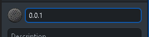
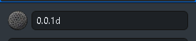

# Contributing Guidelines - *Version*

* Version
  * A version details both the patch and state of the project encapsulated as a specific number with a proceeding symbol.
  * The version is to be documented in the version [logs](versions.md) as well as [changelog](changelog).

* Version Number
  * Version number signifies the current patch and iteration of the system.
  * Version number is in three numbers, separated by a period (".").
    * First number signifies the major patch, major changes in  the system such as structure revisions.
    * Second number signifies the minor patch, minor chanegs in the system such as typographic corrections.
    * Third number signifies the iteration patch, an iteration of a specific patch in the system.

* Version Signatures
  * Signature signifies the current state of the project as per version.
  * Refer to the table below:

| Signature | Symbol | Example | Meaning                                                                                                       |
|-----------|--------|---------|---------------------------------------------------------------------------------------------------------------|
| Alpha     | a      | 1.0.3a  | Version is a launch version, finalized and for client use                                                     |
| Beta      | b      | 2.1.0b  | Version is a testing version, non-finalized and for tester use                                                |
| Delta     | d      | 0.1.5d  | Version is a development version, non-finalized and for developer use only                                    |
| Epsilon   | e      | 0.2.3e  | Version is an engine launch version, internal system patched and supercedes the current working alpha version |
| Phi       | p      | 1.0.3p  | Version is an engine testing version, internal system patched as a beta version, supercedes any versions      |

* Commits to the repository shall have the current/worrking version as per [record](versions.md).
  * Version signature is not required for commit name, but is advised.
  * Examples:

> *Commit Name without Version Signature*

> *Commit Name with Version Signature*

* Version is only to be superceded when all goals in [record](versions.md) are met.
  * Superceding a version refers to the change in a major number in the version number.
  * All patches are not superceeded unless the goal the documented is met, specifically for minor level patches.
  * Iteration is subsequently superceeded whenever a new higher iteration is published.
